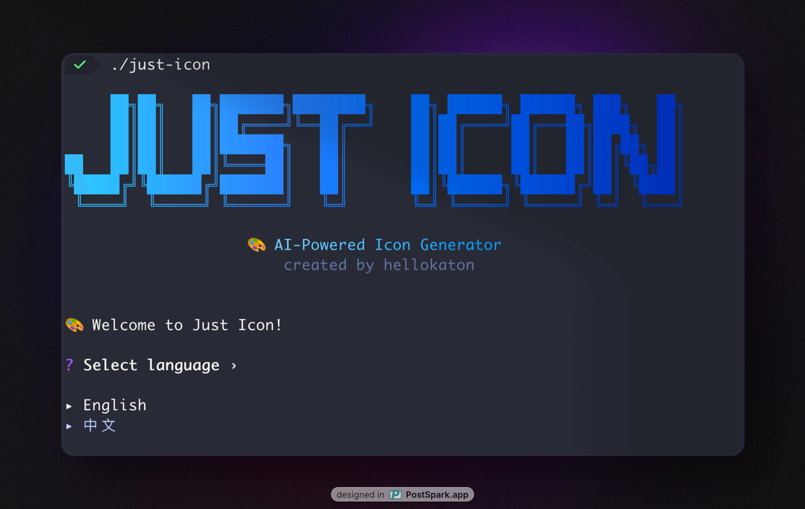
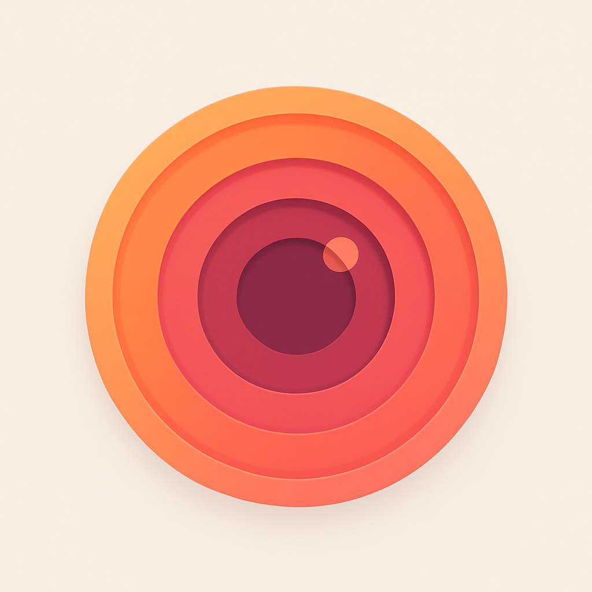

# Just Icon ⚡

English | [简体中文](README_zh.md)

> AI-powered icon generation CLI tool built with Go

Create stunning app icons in seconds using [KatonAI](https://api.katonai.dev) `gpt-image-1` API. A Go implementation inspired by SnapAI, perfect for developers who want professional icons without the design drama! 🎨

## 📸 Preview



## ✨ Features

- 🚀 **Lightning Fast** - Generate icons in seconds, not hours
- 🎯 **Cross Platform** - Works everywhere: macOS, Linux, and Windows
- 🛡️ **Privacy First** - Zero data collection, API keys stay local
- 💎 **HD Quality** - Crystal clear icons for any device
- 🔧 **Developer Friendly** - Simple CLI, perfect for CI/CD
- 🌍 **Multilingual** - English and Chinese interfaces
- ⚡ **Interactive Mode** - User-friendly guided experience

## 🚀 Quick Start

### 📦 Installation

Choose your preferred installation method:

#### 📥 **Option 1: Download Binary (Recommended)**

**The easiest way - just download and go!**

1. Go to [Releases](https://github.com/hellokaton/just-icon/releases)
2. Download the binary for your system:
   - **macOS**: `just-icon-darwin-amd64` (Intel) or `just-icon-darwin-arm64` (Apple Silicon)
   - **Linux**: `just-icon-linux-amd64`
   - **Windows**: `just-icon-windows-amd64.exe`

#### 🔧 **Option 2: Install from Source (Go Developers)**

**For Go developers who love to tinker**

```bash
# Requires Go 1.24+
go install github.com/hellokaton/just-icon@latest
```

## 🚀 Getting Started

### Step 1: Get Your API Key

> [!IMPORTANT]
> You'll need an API key to generate icons. Get one at [KatonAI](https://api.katonai.dev)

### Step 2: First Time Setup

Run the app to get started:

```bash
./just-icon
```

It'll walk you through:

- Language preference selection
- API key configuration
- Output directory setup

## 🎨 See It In Action

**Check out what `Just Icon` can do:**

<table width="100%">
  <thead>
    <tr>
      <th width="60%">Prompt</th>
      <th width="40%">Result</th>
    </tr>
  </thead>
  <tbody>
    <tr>
      <td><code>glass-like color-wheel flower made of eight evenly spaced, semi-transparent petals</code></td>
      <td style="text-align: center; vertical-align: middle;"></td>
    </tr>
    <tr>
      <td><code>glass-like sound wave pattern made of five curved, semi-transparent layers flowing in perfect harmony</code></td>
      <td style="text-align: center; vertical-align: middle;"></td>
    </tr>
    <tr>
      <td><code>glass-like speech bubble composed of three overlapping, semi-transparent rounded rectangles with soft gradients</code></td>
      <td style="text-align: center; vertical-align: middle;"></td>
    </tr>
    <tr>
      <td><code>glass-like camera aperture made of six triangular, semi-transparent blades forming a perfect hexagonal opening</code></td>
      <td style="text-align: center; vertical-align: middle;"></td>
    </tr>
    <tr>
      <td><code>stylized camera lens with concentric circles in warm sunset colors orange pink and coral gradients</code></td>
      <td style="text-align: center; vertical-align: middle;"></td>
    </tr>
    <tr>
      <td><code>neon-outlined calculator with electric blue glowing numbers</code></td>
      <td style="text-align: center; vertical-align: middle;"></td>
    </tr>
  </tbody>
</table>

## 🎨 Amazing Example Prompts

Want to create awesome icons? Try these killer prompts:

```bash
# Glass-like design (trending!)
"glass-like color-wheel flower made of eight evenly spaced, semi-transparent petals forming a perfect circle"

# Minimalist apps
"minimalist calculator app with clean geometric numbers and soft gradients"
"fitness tracker app with stylized running figure using vibrant gradient colors"

# Creative concepts
"weather app with glass-like sun and translucent cloud elements"
"music player app with abstract sound waves in soft pastel hues"
"banking app with secure lock symbol and professional gradients"
```

> [!TIP]
> Pro tip: Use descriptive words like "glass-like", "minimalist", "vibrant gradients", and "soft pastel hues" for better results!

### 🛠️ Command Reference

#### Configuration Management

```bash
# Show current configuration
just-icon config --show
```

#### Reset Configuration

```bash
# Reset configuration to defaults
just-icon reset
```

### 🔐 Privacy & Security

**Your data, your rules** 🛡️

- ✅ **Zero tracking** - We collect absolutely nothing
- ✅ **Local storage** - API keys safely stored in `~/just-icon.json`
- ✅ **No telemetry** - No analytics, no phone-home
- ✅ **Open source** - Inspect every line of code
- ✅ **No accounts** - Just download and use

### 🤝 Contributing

Love Just Icon? Let's make it even better!

- 🐛 [Report bugs](https://github.com/hellokaton/just-icon/issues)
- 💡 [Share ideas](https://github.com/hellokaton/just-icon/issues)
- 🔧 [Submit pull requests](https://github.com/hellokaton/just-icon/pulls)

### 📄 License

[MIT](LINESE) License - build amazing things! 🎉

---

## 💡 Inspiration

This project is inspired by [snapai](https://github.com/betomoedano/snapai) - a fantastic Node.js-based icon generation tool. Just Icon brings the same awesome concept to the Go world with enhanced features and better cross-platform support.

---

## 📞 Contact

**Follow the creator:**

- 🐦 X (Twitter): [@hellokaton](https://x.com/hellokaton)

Got questions, feedback, or just want to chat? Hit me up! 👋
