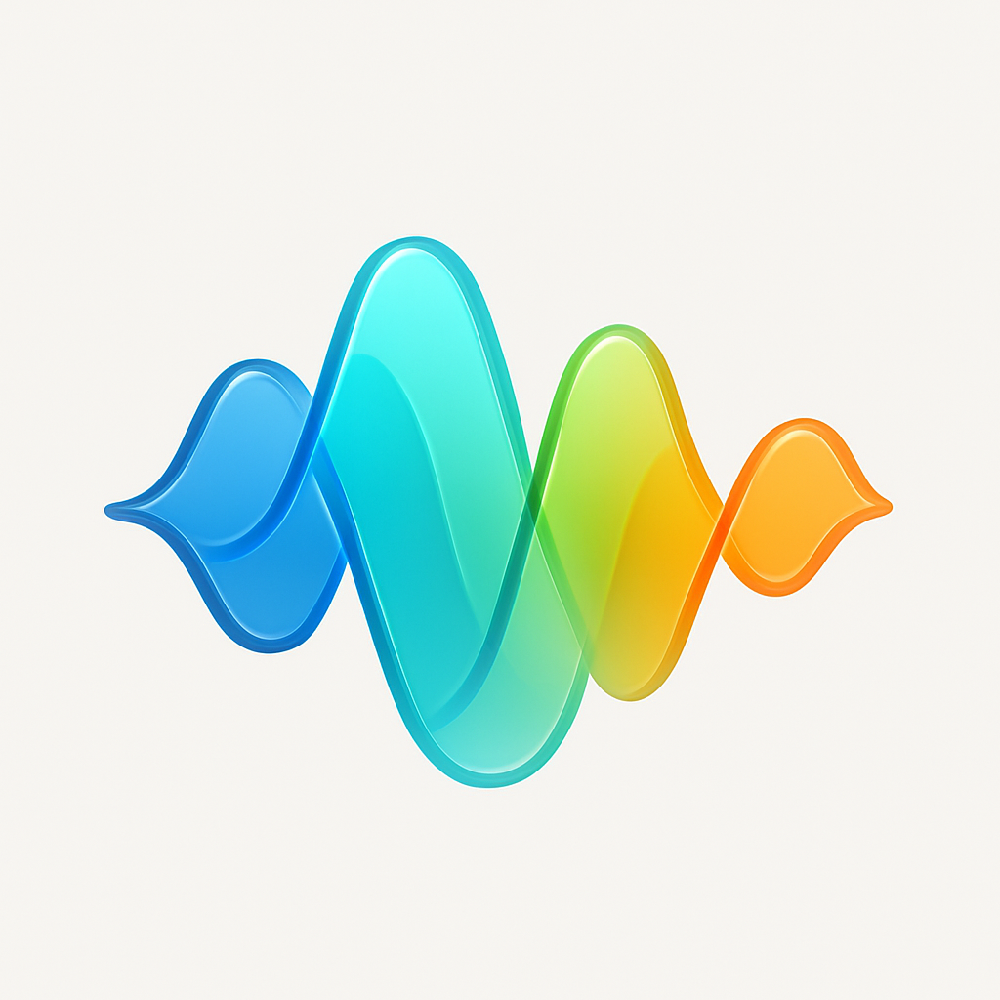

# Just Icon ⚡

English | [简体中文](README_zh.md)

> AI-powered icon generation CLI tool built with Go

Create stunning app icons in seconds using AI image generation via KatonAI service. A Go implementation inspired by SnapAI, perfect for developers who want professional icons without the design hassle! 🎨

### ✨ Features

- 🚀 **Lightning Fast** - Generate icons in seconds, not hours
- 🎯 **Cross Platform** - Works on macOS, Linux, and Windows
- 🛡️ **Privacy First** - Zero data collection, API keys stay local
- 💎 **HD Quality** - Crystal clear icons for any device
- 🔧 **Developer Friendly** - Simple CLI, perfect for CI/CD
- 🌍 **Multilingual** - Support for English and Chinese interfaces
- ⚡ **Interactive Mode** - User-friendly guided experience

### 🚀 Quick Start

#### Installation

```bash
# Install from source (Go 1.24+ required)
go install github.com/hellokaton/just-icon@latest

# Or download binary from releases
https://github.com/hellokaton/just-icon/releases
```

> [!IMPORTANT]
> You'll need an API key to generate icons. Get one at [KatonAI](https://api.katonai.dev) - it costs ~$0.06 per icon!

#### First Time Setup

Run the interactive setup wizard:

```bash
just-icon
```

## 🎨 See It In Action

**Real icons generated with `Just Icon`:**

<table width="100%">
  <thead>
    <tr>
      <th width="60%">Prompt</th>
      <th width="40%">Result</th>
    </tr>
  </thead>
  <tbody>
    <tr>
      <td><code>glass-like color-wheel flower made of eight evenly spaced, semi-transparent petals</code></td>
      <td style="text-align: center; vertical-align: middle;"></td>
    </tr>
    <tr>
      <td><code>glass-like sound wave pattern made of five curved, semi-transparent layers flowing in perfect harmony</code></td>
      <td style="text-align: center; vertical-align: middle;"></td>
    </tr>
    <tr>
      <td><code>glass-like speech bubble composed of three overlapping, semi-transparent rounded rectangles with soft gradients</code></td>
      <td style="text-align: center; vertical-align: middle;"></td>
    </tr>
    <tr>
      <td><code>glass-like camera aperture made of six triangular, semi-transparent blades forming a perfect hexagonal opening</code></td>
      <td style="text-align: center; vertical-align: middle;"></td>
    </tr>
    <tr>
      <td><code>stylized camera lens with concentric circles in warm sunset colors orange pink and coral gradients</code></td>
      <td style="text-align: center; vertical-align: middle;"></td>
    </tr>
    <tr>
      <td><code>neon-outlined calculator with electric blue glowing numbers</code></td>
      <td style="text-align: center; vertical-align: middle;"></td>
    </tr>
  </tbody>
</table>

## 🎨 Amazing Example Prompts

Try these proven prompts that create stunning icons:

```bash
# Glass-like design (trending!)
"glass-like color-wheel flower made of eight evenly spaced, semi-transparent petals forming a perfect circle"

# Minimalist apps
"minimalist calculator app with clean geometric numbers and soft gradients"
"fitness tracker app with stylized running figure using vibrant gradient colors"

# Creative concepts
"weather app with glass-like sun and translucent cloud elements"
"music player app with abstract sound waves in soft pastel hues"
"banking app with secure lock symbol and professional gradients"
```

> [!TIP]
> Use descriptive words like "glass-like", "minimalist", "vibrant gradients", and "soft pastel hues" for better results!

### 🛠️ Command Reference

#### Configuration Management

```bash
# Show current configuration
just-icon config --show
```

#### Reset Configuration

```bash
# Reset configuration to defaults
just-icon reset
```

### 🔐 Privacy & Security

**Your data stays yours** 🛡️

- ✅ **Zero tracking** - We collect absolutely nothing
- ✅ **Local storage** - API keys stored in `~/just-icon.json`
- ✅ **No telemetry** - No analytics, no phone-home
- ✅ **Open source** - Inspect every line of code
- ✅ **No accounts** - Just install and use

### 🤝 Contributing

Love Just Icon? Help make it even better!

- 🐛 [Report bugs](https://github.com/hellokaton/just-icon/issues)
- 💡 [Suggest features](https://github.com/hellokaton/just-icon/issues)
- 🔧 [Submit pull requests](https://github.com/hellokaton/just-icon/pulls)

### 📄 License

[MIT](LINESE) License - build amazing things! 🎉

---

## 💡 Inspiration

This project is inspired by [snapai](https://github.com/betomoedano/snapai) - a fantastic Node.js-based icon generation tool. Just Icon brings the same powerful concept to the Go ecosystem with enhanced features and cross-platform support.
