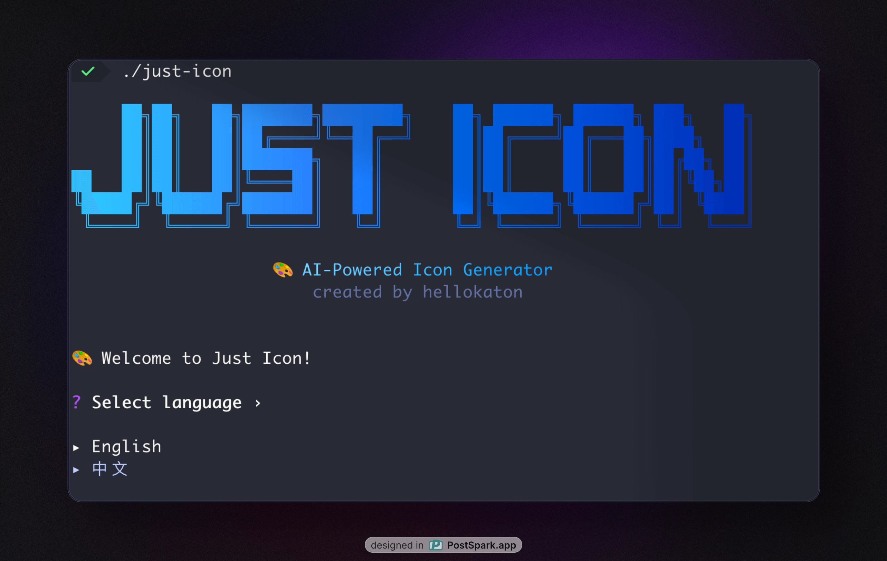

# Just Icon ⚡

[English](README.md) | 简体中文

> 基于 Go 构建的 AI 驱动图标生成 CLI 工具

使用 [KatonAI](https://api.katonai.dev) 的 `gpt-image-1` 接口，几秒钟就能搞定精美的应用图标。受 SnapAI 启发打造的 Go 版本，专为想要专业图标但不想折腾设计的开发者而生！🎨

## 📸 预览



## ✨ 亮点特性

- 🚀 **快如闪电** - 几秒钟搞定图标，告别熬夜加班
- 🎯 **全平台制霸** - macOS、Linux、Windows 通通支持
- 🛡️ **隐私至上** - 零数据收集，API 密钥只在本地
- 💎 **高清画质** - 任何设备都能完美呈现
- 🔧 **开发者福音** - 简洁 CLI，CI/CD 的完美搭档
- 🌍 **中英双语** - 界面语言随心切换
- ⚡ **交互体验** - 友好引导，上手即用

## 🚀 快速开始

### 📦 安装方式

选择适合您的安装方式：

#### 📥 **方式一：下载二进制文件（推荐）**

**最简单的方式 - 下载即用！**

1. 前往 [发布页面](https://github.com/hellokaton/just-icon/releases)
2. 下载适合您系统的二进制文件：
   - **macOS**: `just-icon-darwin-amd64` (Intel) 或 `just-icon-darwin-arm64` (Apple Silicon)
   - **Linux**: `just-icon-linux-amd64`
   - **Windows**: `just-icon-windows-amd64.exe`

#### 🔧 **方式二：从源码安装（Go 开发者）**

**适合喜欢折腾的 Go 开发者**

```bash
# 需要 Go 1.24+
go install github.com/hellokaton/just-icon@latest
```

## 🚀 开始使用

### 第一步：获取 API 密钥

> [!IMPORTANT]
> 您需要一个 API 密钥来生成图标。请在 [KatonAI](https://api.katonai.dev) 获取

### 第二步：首次设置

运行程序开始配置：

```bash
just-icon
```

程序会友好地引导您完成：

- 语言偏好选择
- API 密钥配置
- 输出目录设置

## 🎨 实际效果展示

**看看 Just Icon 的实际效果：**

<table width="100%">
  <thead>
    <tr>
      <th width="60%">提示词</th>
      <th width="40%">结果</th>
    </tr>
  </thead>
  <tbody>
    <tr>
      <td><code>glass-like color-wheel flower made of eight evenly spaced, semi-transparent petals</code></td>
      <td style="text-align: center; vertical-align: middle;"></td>
    </tr>
    <tr>
      <td><code>glass-like sound wave pattern made of five curved, semi-transparent layers flowing in perfect harmony</code></td>
      <td style="text-align: center; vertical-align: middle;"></td>
    </tr>
    <tr>
      <td><code>glass-like speech bubble composed of three overlapping, semi-transparent rounded rectangles with soft gradients</code></td>
      <td style="text-align: center; vertical-align: middle;"></td>
    </tr>
    <tr>
      <td><code>glass-like camera aperture made of six triangular, semi-transparent blades forming a perfect hexagonal opening</code></td>
      <td style="text-align: center; vertical-align: middle;"></td>
    </tr>
    <tr>
      <td><code>stylized camera lens with concentric circles in warm sunset colors orange pink and coral gradients</code></td>
      <td style="text-align: center; vertical-align: middle;"></td>
    </tr>
    <tr>
      <td><code>neon-outlined calculator with electric blue glowing numbers</code></td>
      <td style="text-align: center; vertical-align: middle;"></td>
    </tr>
  </tbody>
</table>

## 🎨 精彩示例提示词

想要创建出色的图标？来试试这些超棒的提示词：

```bash
# 玻璃质感设计（流行趋势！）
"glass-like color-wheel flower made of eight evenly spaced, semi-transparent petals forming a perfect circle"

# 极简应用
"minimalist calculator app with clean geometric numbers and soft gradients"
"fitness tracker app with stylized running figure using vibrant gradient colors"

# 创意概念
"weather app with glass-like sun and translucent cloud elements"
"music player app with abstract sound waves in soft pastel hues"
"banking app with secure lock symbol and professional gradients"
```

> [!TIP]
> 小贴士：多用一些描述性词汇，比如 "glass-like"（玻璃质感）、"minimalist"（极简风格）、"vibrant gradients"（鲜艳渐变）和 "soft pastel hues"（柔和色调），效果会更棒哦！

### 🛠️ 命令参考

#### 配置管理

```bash
# 显示当前配置
just-icon config --show
```

#### 重置配置

```bash
# 重置配置为默认值
just-icon reset
```

### 🔐 隐私与安全

**您的数据，您做主** 🛡️

- ✅ **零跟踪** - 我们绝对不收集任何数据
- ✅ **本地存储** - API 密钥安全存储在 `~/just-icon.json`
- ✅ **无遥测** - 没有分析，没有回传
- ✅ **开源透明** - 每一行代码都可以查看
- ✅ **无需注册** - 下载即用，简单方便

### 🤝 参与贡献

喜欢 Just Icon？一起让它变得更棒吧！

- 🐛 [报告 Bug](https://github.com/hellokaton/just-icon/issues)
- 💡 [提出想法](https://github.com/hellokaton/just-icon/issues)
- 🔧 [贡献代码](https://github.com/hellokaton/just-icon/pulls)

### 📄 许可证

[MIT](LINESE) 许可证 - 构建精彩的东西！🎉

---

## 💡 项目灵感

这个项目的灵感来自于 [snapai](https://github.com/betomoedano/snapai) - 一个非常棒的 Node.js 图标生成工具。Just Icon 把这个绝妙的想法带到了 Go 的世界，还加入了更多实用功能和更好的跨平台支持。

---

## 📞 联系作者

**关注作者动态：**

- 🐦 X (Twitter): [@hellokaton](https://x.com/hellokaton)

有问题、建议或者想聊天？随时欢迎！👋
