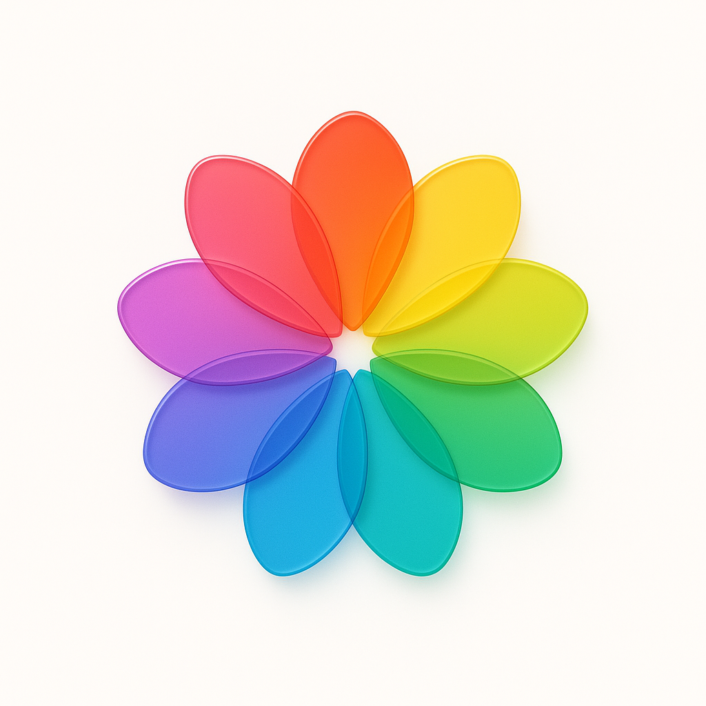
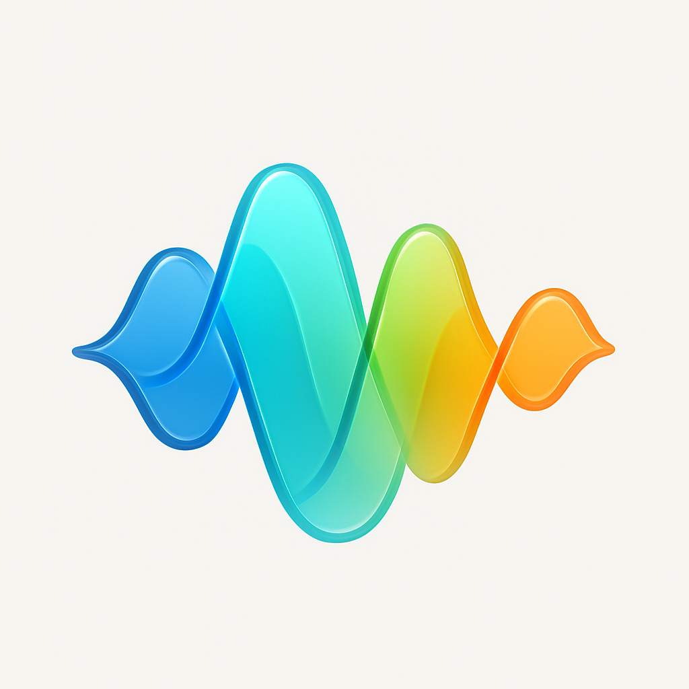
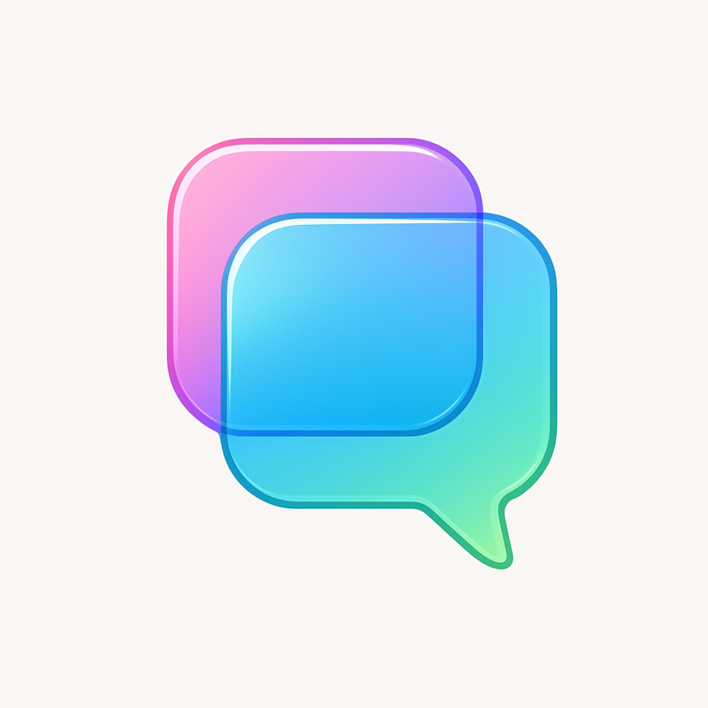
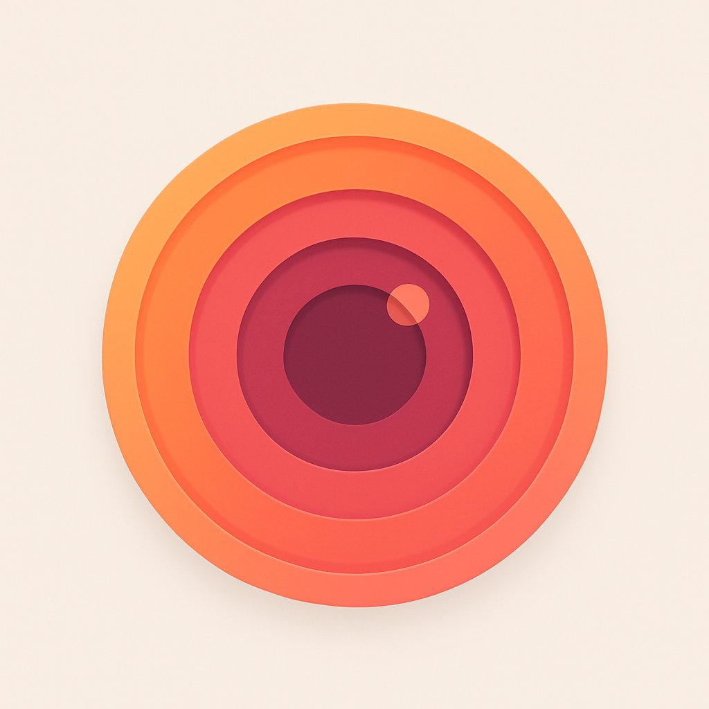
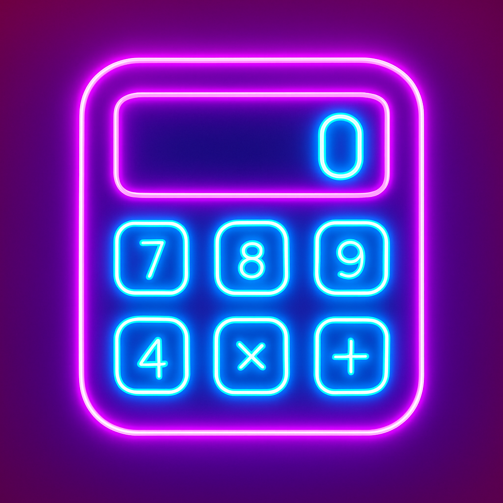

# Just Icon ⚡

[English](README.md) | 简体中文

> 基于 Go 构建的 AI 驱动图标生成 CLI 工具

使用 KatonAI 服务的 AI 图像生成功能，在几秒钟内创建令人惊艳的应用图标。这是一个受 SnapAI 启发的 Go 实现，非常适合希望获得专业图标而无需设计麻烦的开发者！🎨

## ✨ 特性

🚀 **闪电般快速** - 几秒钟生成图标，而非几小时
🎯 **跨平台** - 支持 macOS、Linux 和 Windows
🛡️ **隐私优先** - 零数据收集，API 密钥保存在本地
💎 **高清质量** - 适用于任何设备的清晰图标
🔧 **开发者友好** - 简单的 CLI，完美适配 CI/CD
🌍 **多语言** - 支持中英文界面
⚡ **交互模式** - 用户友好的引导体验

## 🚀 快速开始

### 安装

```bash
# 从源码安装 (需要 Go 1.24+)
go install github.com/hellokaton/just-icon@latest

# 或从发布页面下载二进制文件
https://github.com/hellokaton/just-icon/releases
```

> [!IMPORTANT]
> 您需要一个 API 密钥来生成图标。请在 [KatonAI](https://api.katonai.dev) 获取 - 每个图标约 $0.06！

### 首次设置

运行交互式设置向导：

```bash
just-icon
```

## 🎨 实际效果展示

**使用 Just Icon 生成的真实图标：**

<table width="100%">
  <thead>
    <tr>
      <th width="60%">提示词</th>
      <th width="40%">结果</th>
    </tr>
  </thead>
  <tbody>
    <tr>
      <td><code>glass-like color-wheel flower made of eight evenly spaced, semi-transparent petals</code></td>
      <td></td>
    </tr>
    <tr>
      <td><code>glass-like sound wave pattern made of five curved, semi-transparent layers flowing in perfect harmony</code></td>
      <td></td>
    </tr>
    <tr>
      <td><code>glass-like speech bubble composed of three overlapping, semi-transparent rounded rectangles with soft gradients</code></td>
      <td></td>
    </tr>
    <tr>
      <td><code>glass-like camera aperture made of six triangular, semi-transparent blades forming a perfect hexagonal opening</code></td>
      <td></td>
    </tr>
    <tr>
      <td><code>stylized camera lens with concentric circles in warm sunset colors orange pink and coral gradients</code></td>
      <td></td>
    </tr>
    <tr>
      <td><code>neon-outlined calculator with electric blue glowing numbers</code></td>
      <td></td>
    </tr>
  </tbody>
</table>

## 🎨 精彩示例提示词

试试这些经过验证的提示词，它们能创建令人惊艳的图标：

```bash
# 玻璃质感设计（流行趋势！）
"glass-like color-wheel flower made of eight evenly spaced, semi-transparent petals forming a perfect circle"

# 极简应用
"minimalist calculator app with clean geometric numbers and soft gradients"
"fitness tracker app with stylized running figure using vibrant gradient colors"

# 创意概念
"weather app with glass-like sun and translucent cloud elements"
"music player app with abstract sound waves in soft pastel hues"
"banking app with secure lock symbol and professional gradients"
```

> [!TIP]
> 使用描述性词汇如 "glass-like"、"minimalist"、"vibrant gradients" 和 "soft pastel hues" 可以获得更好的效果！

### 🛠️ 命令参考

#### 配置管理

```bash
# 显示当前配置
just-icon config --show
```

#### 重置配置

```bash
# 重置配置为默认值
just-icon reset
```

### 🔐 隐私与安全

**您的数据属于您** 🛡️

- ✅ **零跟踪** - 我们绝对不收集任何数据
- ✅ **本地存储** - API 密钥存储在 `~/just-icon.json`
- ✅ **无遥测** - 无分析，无回传
- ✅ **开源** - 检查每一行代码
- ✅ **无需账户** - 安装即用

### 🤝 贡献

喜欢 Just Icon？帮助我们让它变得更好！

- 🐛 [报告错误](https://github.com/hellokaton/just-icon/issues)
- 💡 [建议功能](https://github.com/hellokaton/just-icon/issues)
- 🔧 [贡献代码](https://github.com/hellokaton/just-icon/pulls)

### 📄 许可证

[MIT](LINESE) 许可证 - 构建精彩的东西！🎉

---

## 💡 项目灵感

本项目灵感来自于 [snapai](https://github.com/betomoedano/snapai) - 一个出色的基于 Node.js 的图标生成工具。Just Icon 将同样强大的概念带到了 Go 生态系统中，并提供了增强功能和跨平台支持。
